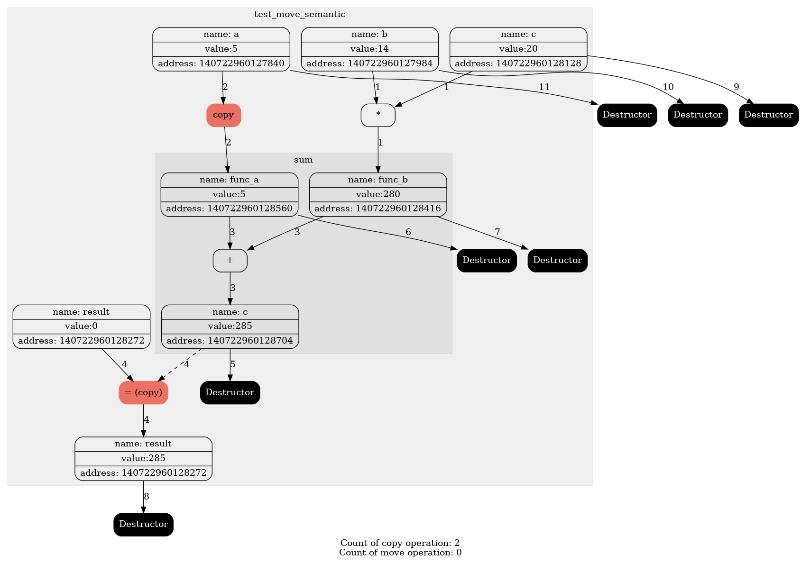
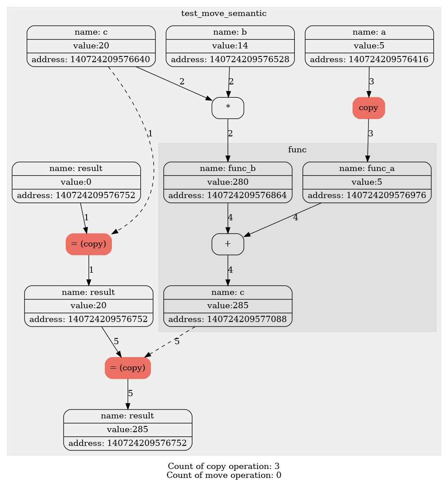
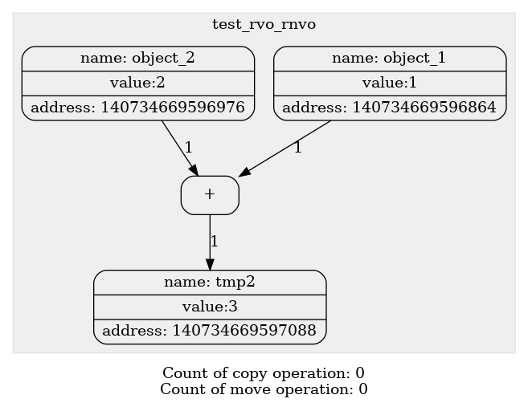
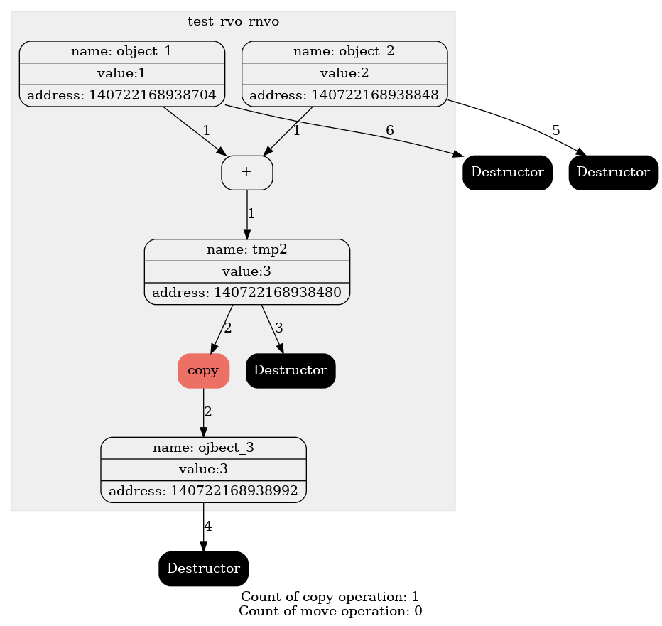
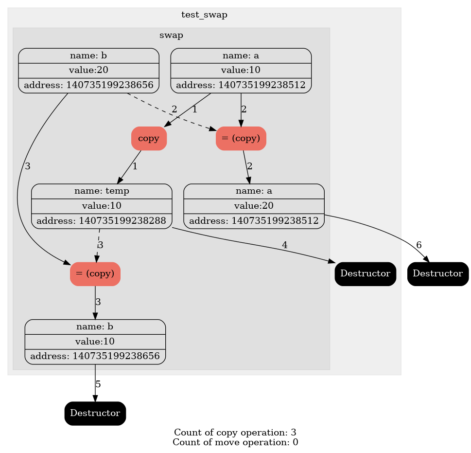
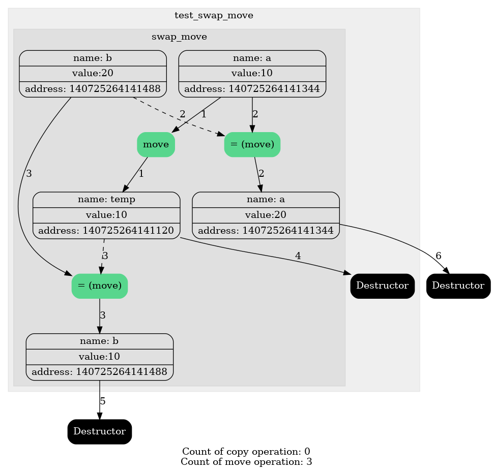
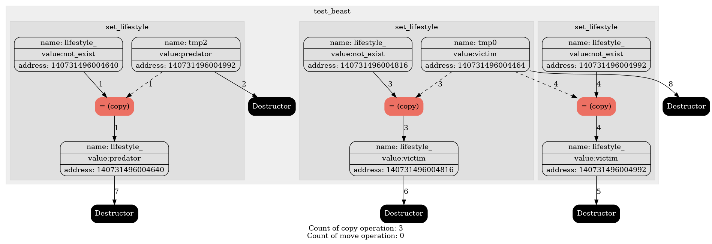
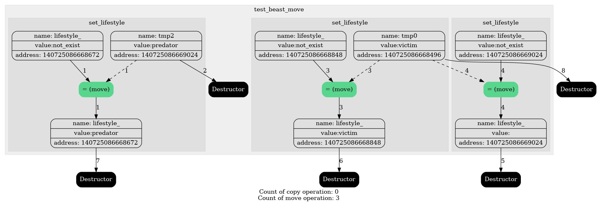
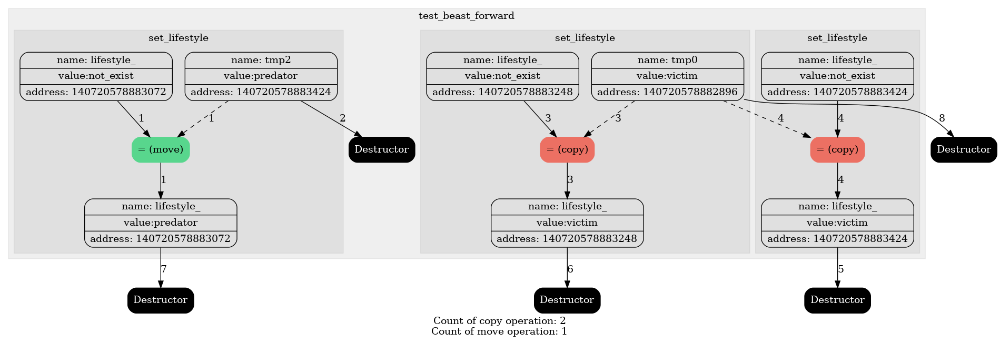

# Предисловие
&nbsp;&nbsp;&nbsp;&nbsp;С приходом эры c++11/14 мир кардинально изменился, обычный мир семантики копирования дополнился незримым миром волшебства- семантики перемещения. Задача этой работы заключается в изучении этого мира, прикрытого завесой тайны, и тех, кто в нем обитает. 

# Среда экспериментов 
 &nbsp;&nbsp;&nbsp;В качестве подопытного, на примере которого мы будем наблюдать проявления копирования и перемещения, выступает класс SuperType\<T\>, который по существу является оберткой над любым типом T. В качестве инструмента для отображения различий семантик копирования и перемещения выступает класс Tracker с его помощником доктором Graphviz и его блок схем. В ходе экспериментов подопытному предстоит в различных модификациях выполнять поставленные задачи.

&nbsp;&nbsp;&nbsp;&nbsp;Для выбора модификаций написан Makefile с командами для компиляции, во время запуска программы указывается название эксперимента и файл, который будет создан для отчета.

&nbsp;&nbsp;&nbsp;&nbsp;Формат компиляции - make {название модификации}.

&nbsp;&nbsp;&nbsp;&nbsp;Формат запуска    - ./main {название эксперимента} {путь к файлу отчета}.
 
# Копирование и Перемещение. Часть первая.
&nbsp;&nbsp;&nbsp;&nbsp;Первая часть исследования заключается в осознании различий семантики копирования и перемещения, а так же мест их использования. Блок схемы этой части построены на основе функции sum.

  
    
    
~~~
template<class T>
SL::SuperType<T> 
sum(SL::SuperType<T> a, SL::SuperType<T> b)
{
    SL::SuperType<int> c = a + b;
    return c;
}

void test_move_semantic()
{
    
    SL::SuperType<int> a(5);
    SL::SuperType<int> b(14);
    SL::SuperType<int> c(20);
    SL::SuperType<int> result(0);

    result = func(a, b * c);
}
~~~

 

Для нормального отображения графа нам придется добавить еще функций. Необходимо переименовать узлы с переменными с помощью метода SuperType<T>::rename(const std::string &name) и выделить функции с помощью макроса start_function() и end_function().
Эти изменения придадут большего понимания графа.

  
    

~~~
template<class T>
SL::SuperType<T> 
sum(SL::SuperType<T> a, SL::SuperType<T> b)
{
    start_function()
    
    a.rename("func_a");
    b.rename("func_b");

    SL::SuperType<int> c = a + b;
    c.rename("c");
   
    end_function()
   
    return c;
}

void test_move_semantic()
{
    start_function();
    
    SL::SuperType<int> a(5);
    a.rename("a");
    SL::SuperType<int> b(14);
    b.rename("b");
    SL::SuperType<int> c(20);
    c.rename("c");
    SL::SuperType<int> result(0);
    result.rename("result");

    result = sum(a, b * c);
    
    end_function();
}
~~~
 
 

## RVO/RNVO
&nbsp;&nbsp;&nbsp;&nbsp; На данном этапе мы имеем красивый граф, но для видения всей картины нам нужно окунуться еще глубже. Рассмотрим такой код.
  
    

~~~
void test_rvo_rnvo()
{
    start_function()
    
    SL::SuperType<int> object_1(1);
    object_1.rename("object_1");
    SL::SuperType<int> object_2(2);
    object_2.rename("object_2");

    SL::SuperType<int> object_3 = object_1 + object_2; 

    end_function()
}
 
// make default
// ./main test_rvo_rnvo ../diagrams/graph_rvo_rnvo.dot
~~~
 
 

&nbsp;&nbsp;&nbsp;&nbsp;Что может быть необычного в графе одной операции сложения? Стоит вспомнить, что возвращаемым объектом операции сложения является не ссылка и не указатель, а сам объект класса. Почему мы не видим создание еще одного узла для этого объекта и его копирования в object_3?
 
&nbsp;&nbsp;&nbsp;&nbsp;Оптимизации компилятора позволяют в некоторых случаях не создавать временный объект, который используется только для инициализации объекта такого же типа. Эта оптимизация носит название RVO/RNVO. Из-за существования некоторых случаев, мы не можем позволить себе закрыть глаза и надеятся, что оптимизация будет работать всегда. 

&nbsp;&nbsp;&nbsp;&nbsp;Флаг -fno-elide-constructors отключает эту оптимизацию и позволит более детально рассмотреть вызовы конструкторов копирования (перемещения) во всех случаях.

   
    

~~~
void test_rvo_rnvo()
{
    start_function()
    
    SL::SuperType<int> object_1(1);
    object_1.rename("object_1");
    SL::SuperType<int> object_2(2);
    object_2.rename("object_2");

    SL::SuperType<int> object_3 = object_1 + object_2; 

    end_function()
}

//  make default_flag
// ./main test_rvo_rnvo ../diagrams/graph_no_rvo_rnvo.dot
~~~

 
 
Наш граф функции sum преобразится вот так.

    
    

Без флага
~~~ 
 make default
 ./main test_move_semantic ../diagrams/graph_no_flag.dot
~~~
С флагом:
~~~
 make default_flag
 ./main test_move_semantic ../diagrams/graph_flag.dot
~~~

## Конструктор и оператор копирования 
&nbsp;&nbsp;&nbsp;&nbsp;Если писать следуя стандартам с++98/03, то мы будем располагать лишь правилом трех, гласящим об определении копирующего конструктора, копирующего присваивания и деструктора. Суть заключается в полном копировании классов с их атрибутами.

  
    
    
~~~
template<class T>
SL::SuperType<T> 
sum(SL::SuperType<T> a, SL::SuperType<T> b)
{
    start_function()
    
    a.rename("func_a");
    b.rename("func_b");

    SL::SuperType<int> c = a + b;
    c.rename("c");
   
    end_function()
   
    return c;
}

void test_move_semantic()
{
    start_function();
    
    SL::SuperType<int> a(5);
    a.rename("a");
    SL::SuperType<int> b(14);
    b.rename("b");
    SL::SuperType<int> c(20);
    c.rename("c");
    SL::SuperType<int> result(0);
    result.rename("result");

    result = sum(a, b * c);
    
    end_function();
}
 
// make default_flag
// ./main test_move_semantic ../diagrams/graph_copy.dot
~~~

 

Полное копирование является ресурсоемкой операцией, поэтому в блок схеме она выделена красным, как нежелательные блоки в программе, хотя в некоторых случаях их избежать нельзя.

## Конструктор и оператор перемещения
&nbsp;&nbsp;&nbsp;&nbsp;В c++11/14 появились понятия rvalue и lvalue ссылок, которые указывают на объекты с разной памятью. У объектов типа lvalue есть идентифицируемое место в памяти, а у rvalue нет, он является временным. Семантика перемещения основана на объектах типа rvalue и дарует возможность оптимизировать код с помощью идеи взятия атрибутов у временного объекта, заменяя собой семантику копирования.

&nbsp;&nbsp;&nbsp;&nbsp;Если описывать идею в деталях, то можно провести циничную аналогию с умирающим и его драгоценностями. Покойник представляет собой временный объект, а его драгоценности это его атрибуты. Будучи живым, объектом lvalue, можно задуматься, а зачем ему сокровища? В общем-то незачем, поэтому объект lvalue может забрать аттрибуты с rvalue, забрав его драгоценности. Чем это отличается от операции копирования? Тем, что если у объектов есть указатель на динамическую память, нам не придется ее копировать по байтам, нам нужно всего лишь взять указатель у rvalue, а у него его забрать, чтобы деструктор не "закопал" драгоценности.

&nbsp;&nbsp;&nbsp;&nbsp; Так появилось правило пяти, которое дополняет правило трех еще двумя о перемещающих конструкторе и операторе присваивания. Они менее ресурсоемкие в сравнении с копирующими, поэтому в блок схеме они горят зеленым, как наиболее желательные для вызова. 

  
    
    
~~~
template<class T>
SL::SuperType<T> 
sum(SL::SuperType<T> a, SL::SuperType<T> b)
{
    start_function()
    
    a.rename("func_a");
    b.rename("func_b");

    SL::SuperType<int> c = a + b;
    c.rename("c");
   
    end_function()
   
    return c;
}

void test_move_semantic()
{
    start_function();
    
    SL::SuperType<int> a(5);
    a.rename("a");
    SL::SuperType<int> b(14);
    b.rename("b");
    SL::SuperType<int> c(20);
    c.rename("c");
    SL::SuperType<int> result(0);
    result.rename("result");

    result = sum(a, b * c);
    
    end_function();
}

// make move_semantic_flag
// ./main test_move_semantic ../diagrams/graph_move.dot
~~~

 

## Сравнение изменений
&nbsp;&nbsp;&nbsp;&nbsp;Несмотря на лучшую производительность компилятор не заменил всю копирующую семантику на перемещающую, так как она становится альтернативой, только когда речь заходит об объектах типа rvalue, выступающих в роли объектов для инициализации или присваивания. Если внимательно посмотреть на код, то становится ясно, что в некоторых случаях без копирования обойтись нельзя.

    
    

## Ошибочные вариации семантики копирования и перемещения

### Ошибочные методы копирования

&nbsp;&nbsp;&nbsp;&nbsp;Стандартным способом объявления копирующих конструктора и оператора присваивания является такой код:
~~~
SuperType<T>(const SuperType<T> &that, const std::string &name = "");    
SuperType<T> &operator= (const SuperType<T> &that);
~~~
&nbsp;&nbsp;&nbsp;&nbsp;Несмотря на это по ошибке можно задать эти два метода так.
~~~
SuperType<T>(SuperType<T> &that, const std::string &name = "");
SuperType<T> &operator= (SuperType<T> &that);
~~~
&nbsp;&nbsp;&nbsp;&nbsp;Единственное, что изменится с неправильным вариантом, это отсутствие возможности использования конструктора и оператора с константными объектами. Во время компиляции кода мы выхватим целую простыночку ошибок, так как наш копирующий конструктор работать с const объектами не умеет, а аналог для const автоматически сгенерирован не был из-за уже определенного специфичного конструктора не для const.

Команды для эксперимента

~~~
 make wrong_copy_semantic_flag
 ./main test_move_semantic ../diagrams/graph_wrong_copy.dot
~~~
 
### Ошибочные методы перемещения

&nbsp;&nbsp;&nbsp;&nbsp;Аналогично с кодом для семантики перемещения.
Перемещающие методы обычно выглядят так 
~~~
SuperType<T>(SuperType<T> &&that, const std::string &name = "");
SuperType<T> &operator= (SuperType<T> &&that);
~~~
&nbsp;&nbsp;&nbsp;&nbsp;Несмотря на это по ошибке ее можно задать так
~~~
SuperType<T>(const SuperType<T> &&that, const std::string &name = "");
SuperType<T> &operator= (const SuperType<T> &&that);
~~~

&nbsp;&nbsp;&nbsp;&nbsp;Код скомпилируется, однако вся магия семантики перемещения улетучится и мы вернемся обратно во времена с++98/03, когда всем миром правила семантика копирования. Причиной станет константность, котороая не позволит выполнить обмен полями и перемещение превратится в копирование. Блок схема в таком случае преобразится.

 

    
    
 

 
 ~~~
  make wrong_move_semantic_flag
  ./main test_move_semantic ../diagrams/graph_wrong_move.dot
 ~~~
 
## Резюмируем
&nbsp;&nbsp;&nbsp;&nbsp;На первый взгляд может сложиться впечатление, что можно остаться в старом мире, в котором правит всем понятное копирование, а все нововведения с приходом семантики перемещения это over engineering, так как она применяется не на каждом шагу. Однако на продемонстрированном простом примере можно наблюдать, что она применяется гораздо чаще, чем это может казаться.

# Чудеса или универсальная ссылка. Часть вторая.
 С появлением понятий lvalue и rvalue ссылок, пришло понятие универсальной ссылки. Универсальная ссылка это шаблонная ссылка, которая может быть как rvalue, так и lvalue. 
 
 
 
 На практике она будет выглядеть так
~~~
template <typename T>
void func(T&& param, std::string param_name)
{
    using boost::typeindex::type_id_with_cvr;

    std::cout << "T: " << type_id_with_cvr<T>().pretty_name() << '\n';

    std::cout << "param: " << param_name << " is " << type_id_with_cvr<decltype(param)>().pretty_name() << "\n\n" ;
}

int main()
{
    SuperType<int> object_1(100500);

    func(object_1, "object_1");
    func(SuperType<int>(100500), "object_2");
}

// make move_semantic_flag
// ./main test_universal_reference
~~~
 
 И не возникнет удивления, если в консоли мы увидим лог о двух rvalue ссылках. Но так не будет, консоль покажет нам:
 ~~~
 T: SL::SuperType<int>&
 param: object_1 is SL::SuperType<int>&

 T: SL::SuperType<int>
 param: object_2 is SL::SuperType<int>&&
 ~~~
 
Её поведение объясняется на примере флюгера, чье положение зависит от направления ветра. Ссылка становится lvalue или rvalue в зависимости от того, какие параметры ей придут.
 
 # Move vs Forward. Часть третья.
&nbsp;&nbsp;&nbsp;&nbsp;Вот мы и добрались до фантастических тварей, пришедших вместе с новым миром: move и forward. Главное, что о них стоит сейчас понять, что они ничего не делают.
 
 &nbsp;&nbsp;&nbsp;&nbsp;move - ничего не перемещает.
 
 &nbsp;&nbsp;&nbsp;&nbsp;forward - ничего не передает.
 
&nbsp;&nbsp;&nbsp;&nbsp;Зачем же они нужны, если они "ничего не делают"? Оказывается, это не совсем так. 
 
Move выполняет безусловное приведение своего аргумента к rvalue.
~~~
template <typename T>
decltype(auto) move(T &&param)
{
    using ReturnType = std::remove_reference_t<T>&&;
    return static_cast<ReturnType>(param);
}
~~~

Forward выполняет приведение при определенных условиях.
~~~
template <typename T>
T&& forward(std::remove_reference_t<T>& x) noexcept
{
    return static_cast<T &&>(x);
}
~~~

## Move

Разберем простейший пример функции swap.
 
  
    
    
~~~
template<class T>
void swap(T &object1, T &object2)
{    
    start_function();
 
 using T_ = std::remove_reference_t<T>;

    T_ temp(object1);
    temp.rename("temp");
    object1 = object2;
    object2 = temp;
 
    end_function();
}

void test_swap()
{
    start_function();

    SL::SuperType<int> a(10);
    a.rename("a");
    SL::SuperType<int> b(20);
    b.rename("b");
    
    swap_simple(dynamic_cast<SL::SuperType<int> &&>(a), 
                dynamic_cast<SL::SuperType<int> &&>(b));

    end_function();
}

// make move_semantic_flag
// ./main test_swap ../diagrams/graph_swap.dot
~~~

 
 
&nbsp;&nbsp;&nbsp;&nbsp;Все работает через копирование. Если задуматься, то семантика перемещения нам бы здесь не помешала, и, кажется, уже есть в голове решение использовать move.

   
    
    
~~~
template<class T>
void swap_move(T &object1, T &object2)
{    
    start_function();
 
    T_ temp(SL::move(object1));
    temp.rename("temp");
    object1 = SL::move(object2);
    object2 = SL::move(temp);
    
    end_function();
}

void test_swap_move()
{
    start_function();

    SL::SuperType<int> a(10);
    a.rename("a");
    SL::SuperType<int> b(20);
    b.rename("b");

    swap_move(a, b);

    end_function();
}
 
// make move_semantic_flag
// ./main test_swap_move ../diagrams/graph_swap_move.dot
~~~
 
 

&nbsp;&nbsp;&nbsp;&nbsp; Отлично, копирования больше нет. Какая же крутая функция move, что может с помощью своей волшебной палочки, дубинки, заставить кого угодно быть rvalue. 

 ## Forward
 &nbsp;&nbsp;&nbsp;&nbsp; Разберем следующий пример на классе Beast.

~~~
class Beast
{
public:
    SL::SuperType<std::string> lifestyle_;

    Beast() : lifestyle_("not_exist") {
        lifestyle_.rename("lifestyle_");
    }

    template<class T>
    void set_lifestyle(T&& lifestyle)
    {
        start_function()
 
        lifestyle_ = lifestyle;
 
        end_function()
    }
};
~~~
 
&nbsp;&nbsp;&nbsp;&nbsp;Казалось бы, исследуя мир семантики перемещения и её законов, мы можем решить, что все будет основанно на перемещениях. Если только... Если только мы передаем в функцию аргументы в стиле rvalue, так как универсальная ссылка будет rvalue только при них. Хорошо, сделаем так, как просят того от нас законы мира волшебства, и да прибудет с нами сила перемещения...

 ~~~
class Beast
{
public:
    SL::SuperType<std::string> lifestyle_;

    Beast() : lifestyle_("not_exist") {
        lifestyle_.rename("lifestyle_");
    }

    template<class T>
    void set_lifestyle(T&& lifestyle)
    {
        start_function()

        lifestyle_ = lifestyle;
        
        end_function()
    }
};

void test_beast()
{
    start_function();

    SL::SuperType<std::string> victim("victim");

    Beast lion;
    lion.set_lifestyle(SL::SuperType<std::string>("predator"));

    Beast sheep;
    sheep.set_lifestyle(SL::move(victim));

    Beast cow;
    cow.set_lifestyle(SL::move(victim));
    
    end_function();
}
 
// make move_semantic_flag
// ./main test_beast ../diagrams/graph_beast.dot 
~~~
 

 
 &nbsp;&nbsp;&nbsp;&nbsp;Однако никакого перемещения с нами не прибыло, только руки все в чем... хм, запах копирования. Но в чем проблема? Где наше перемещение, почему мы снова в мире маглов, а волшебного мира как-будто и не было?

&nbsp;&nbsp;&nbsp;&nbsp;Проблема заключается в том, что аргументы функции ссылки rvalue, но самими rvalue они не являются, у них же есть свои имена (отличительная особенность lvalue). Что тогда делать? Мы снова вспоминаем про супер move, который позволит нам даже аргументы функции не приводить к rvalue.

~~~
class Beast_move
{
public:
    SL::SuperType<std::string> lifestyle_;

    Beast_move() : lifestyle_("not_exist") {
        lifestyle_.rename("lifestyle_");
    }

    template<class T>
    void set_lifestyle(T&& lifestyle)
    {
        start_function()
        lifestyle_ = SL::move(lifestyle);
        end_function()
    }
};

void test_beast_move()
{
    start_function();

    SL::SuperType<std::string> victim("victim");

    Beast_move lion;
    lion.set_lifestyle(SL::SuperType<std::string>("predator"));

    Beast_move sheep;
    sheep.set_lifestyle(victim);

    Beast_move cow;
    cow.set_lifestyle(victim);

    end_function();
}
 
// make move_semantic_flag 
// ./main test_beast_move ../diagrams/graph_beast_move.dot
~~~
 

 
Move спасает мир, но какой ценой... Ценой всего. Move переборщивает с прибабахом. Ранее перемещение объяснялось на примере мертвых и это не спроста. Приведение к rvalue это подстать убийству, rvalue это мертвый объект, которому в этом мире ничего уже не надо, это "мародерство". То, чем мы занимаемся, это "грабеж средь бела дня" без задней мысли о том, что будет с тем, у кого мы украли. Неужели придется запереть move до лучших времен очевидного swap, а самим сидеть в скучном мире копирования...

## Forward

&nbsp;&nbsp;&nbsp;&nbsp;И тут из леса выходит новый зверь, forward. Что такое функция forward? Ранее было сказано, что у нее какое-то условное приведение и бла-бла-бла. Видимо, у нее какая-то особая миссия, давайте проверим.

~~~
class Beast_forward
{
public:
    SL::SuperType<std::string> lifestyle_;

    Beast_forward() : lifestyle_("not_exist") {
        lifestyle_.rename("lifestyle_");
    }

    template<class T>
    void set_lifestyle(T&& lifestyle)
    {
        start_function()
        lifestyle_ = SL::forward<T>(lifestyle);
        end_function()
    }
};

void test_beast_forward()
{
    start_function();

    SL::SuperType<std::string> victim("victim");

    Beast_forward lion;
    lion.set_lifestyle(SL::SuperType<std::string>("predator"));

    Beast_forward sheep;
    sheep.set_lifestyle(victim);

    Beast_forward cow;
    cow.set_lifestyle(victim);
    
    end_function();
}

// make move_semantic_flag
// ./main test_beast_forward ../diagrams/graph_beast_forward.dot
~~~
 
 

&nbsp;&nbsp;&nbsp;&nbsp;О чудо! Сила перемещения переполняет нас, и всё работает так, как мы... Хотели? Да, мы этого хотели, но кто такой forward, и почему он нам помог? Оказывается, что forward делает условное приведение, rvalue к rvalue, lvalue к lvalue. 

&nbsp;&nbsp;&nbsp;&nbsp;На этом моменте можно в полной мере осознать смысл универсальной ссылки, который мог быть непонятен ранее. Идея заклчючается в возможности оптимизации кода там, где это возможно, в случае с Beast с функцией set_lifestyle(). Благодаря этому типу ссылки мы получили возможность изменение lifestyle_ с помощью разных семантик, не дублируя функцию для lvalue и rvalue.

## Итоги сравнения 

&nbsp;&nbsp;&nbsp;&nbsp;Может показаться, что forward это универсальный способ решения всех наших проблем, кроме тех, где нужен лом, где мы явное lvalue приводим к rvalue, как в функции swap. Быть может, это наш философский камень. С технической точки зрения ответ утвердительный: forward может сделать все, необходимости в move нет.

&nbsp;&nbsp;&nbsp;&nbsp;Привлекательными сторонами move являются удобства, снижение вероятности ошибок и большая ясность. Поэтому стоит использовать move там, где мы на свой страх и риск приводим lvalue к rvalue или явно приведена ссылка на rvalue, а в случае универсальной ссылки стоит ограничиться forward.

# Итоги работы
&nbsp;&nbsp;&nbsp;&nbsp; К концу этой работы мы разобрали законы и принципы загадочного мира перемещения, убедившись в размере его возможного влияния на реальность. Мы приручили его обитателей, чьи умения дают нам еще больше сил и оптимизаций. Теперь мы можем себя величать настоящими волшебниками, использующими весь спектр возможностей мира волшебства.
