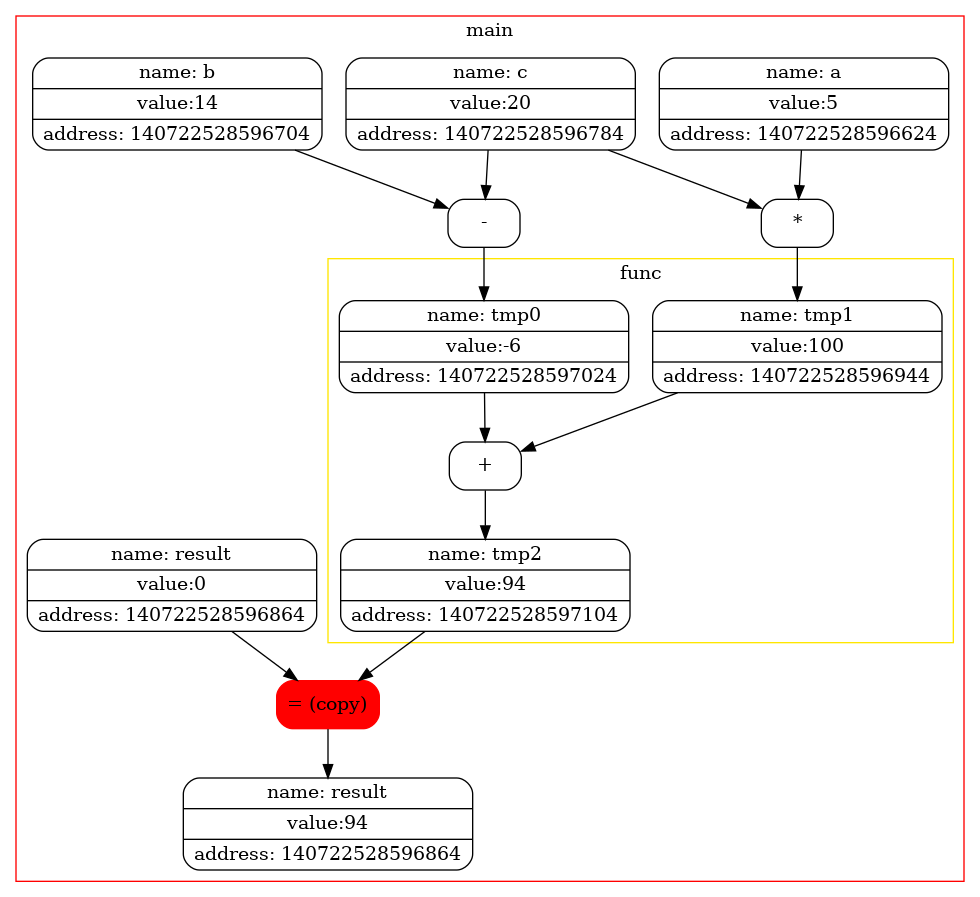
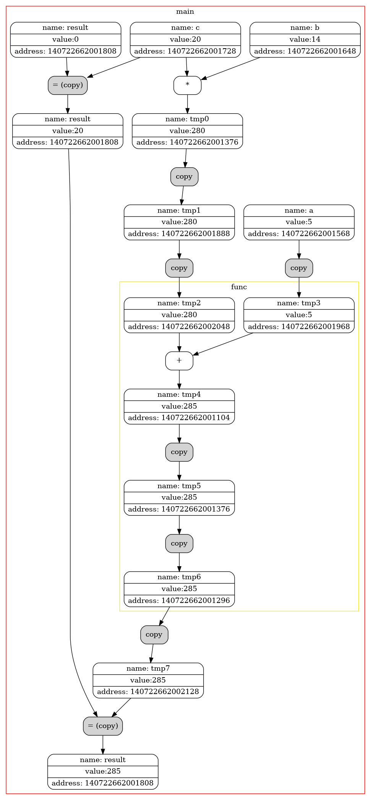

# Копирование и Перемещение
Задачей этой работы является детальное изучение разницы между семантикой копирования и перемещения с подробной визуализацией.
# Специальный флаг
Оптимизации компилятора позволяют не создавать временный объект, который используется только для инициализации объекта такого же типа. 
Флаг -fno-elide-constructors отключает эту оптимизацию и позволит более детально рассмотреть вызовы конструкторов копирования (перемещения) во всех случаях.

<table>
<tbody>
<tr>
<td></td>
<td></td>
<td>столбец3</td>
</tr>
</tbody>
</table>
