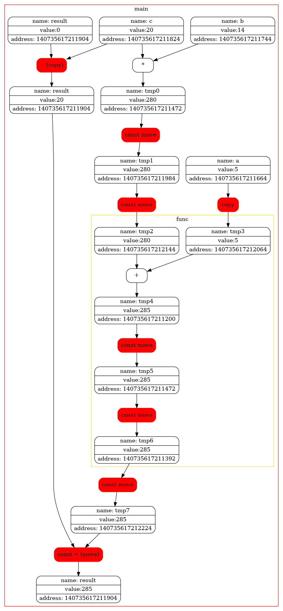

# Копирование и Перемещение
Задачей этой работы является детальное изучение разницы между семантикой копирования и перемещения с подробной визуализацией библиотеки graphviz.
Блок схемы построены на основе незамысловатого кода

```
#include "SuperType.hpp"
          
#define start_function() Tracker::getInstance().print_open_func(__func__);
#define end_function()   Tracker::getInstance().print_close_func(__func__);


template<class T>
SuperType<T> func(SuperType<T> a, SuperType<T> b)
{
    start_function()
    SuperType<int> c = a + b;
    end_function()
    return c;
}

int main()
{
    start_function();
    
    SuperType<int> a(5,  "a");
    SuperType<int> b(14, "b");
    SuperType<int> c(20, "c");
    SuperType<int> result(0, "result");
    
    result = c;
    result = func(a, b * c);
    
    end_function();
}
```
    
# Специальный флаг
Оптимизации компилятора позволяют не создавать временный объект, который используется только для инициализации объекта такого же типа. 
Флаг -fno-elide-constructors отключает эту оптимизацию и позволит более детально рассмотреть вызовы конструкторов копирования (перемещения) во всех случаях.

<p>
    
    
</p>

# Конструктор и оператор копирования 
Если писать следуя стандартам с++98/03, то мы будем располагать лишь копирующими конструкторами, суть которых заключается в полном копировании классов с их атрибутами. Полное копирование является ресурсоемкой операцией, поэтому в блок схеме она выделена красным, как нежелательные блоки в программе, хотя в некоторых случаях их избежать нельзя.

<p> 
    
</p>

# Конструктор и оператор перемещения
В c++11/14 появилась семантика перемещения, дарующя возможность оптимизировать код с помощью идеи обмена атрибутами с умирающими объектами, заменяя собой семантику копирования. Перемещающие конструкторы и операторы присваивания менее ресурсоемкие в сравнении с копирующими, поэтому в блок схеме они горят зеленым, как наиболее желательные для вызова. 

<p>    
    
</p>  

Несмотря на лучшую производительность компилятор не заменил всю копирующую семантику на перемещающую, так как она становятся альтернативой, только когда речь заходит об объектах типа rvalue, выступающих в роли объектов для инициализации или присваивания. Если внимательно посмотреть на код, то становится ясно, что в некоторых случаях без копирования обойтись нельзя.

# Странные вариации семантики копирования и перемещения
Стандартным способом определения копирующих конструктора и оператора присваивания является такой код:
~~~
SuperType<T>(const SuperType<T> &that, const std::string &name = "");    
SuperType<T> &operator= (const SuperType<T> &that);
~~~
Не смотря на это по ошибке можно задать эти два метода так
~~~
SuperType<T>(SuperType<T> &that, const std::string &name = "");
SuperType<T> &operator= (SuperType<T> &that);
~~~
Единственное, что изменится с неправильным вариантом это отсутствие возможности использования конструктора и оператора с константными объектами. Во время компиляции кода 
```
const SuperType<int> c(20, "c");
SuperType<int> result(c);
```
мы получим ошибку вида 

которая является вполне логичной, тк объект с не является константным. 
Аналогично с кодом 
```
const SuperType<int> c(20, "c");
SuperType<int> result(0, "result");
    
result = c;
```
мы получим 


Копирующая семантика обычно выглядит так 
```
SuperType<T>(SuperType<T> &&that, const std::string &name = "");
SuperType<T> &operator= (SuperType<T> &&that);
```
Не смотря на это по ошибке ее можно задать так
```
SuperType<T>(const SuperType<T> &&that, const std::string &name = "");
SuperType<T> &operator= (const SuperType<T> &&that);
```
Код скомпилируется, однако вся магия семантики перемещения улетучится и мы вернемся обратно во времена с++98/03, когда всем миром правила семантика копировани. Причиной станет константность, котороая не позволит выполнить обмен полями и перемещение превратится в копирования. Блок схема в таком случае преобразится.
<p>
    
    
</p>
