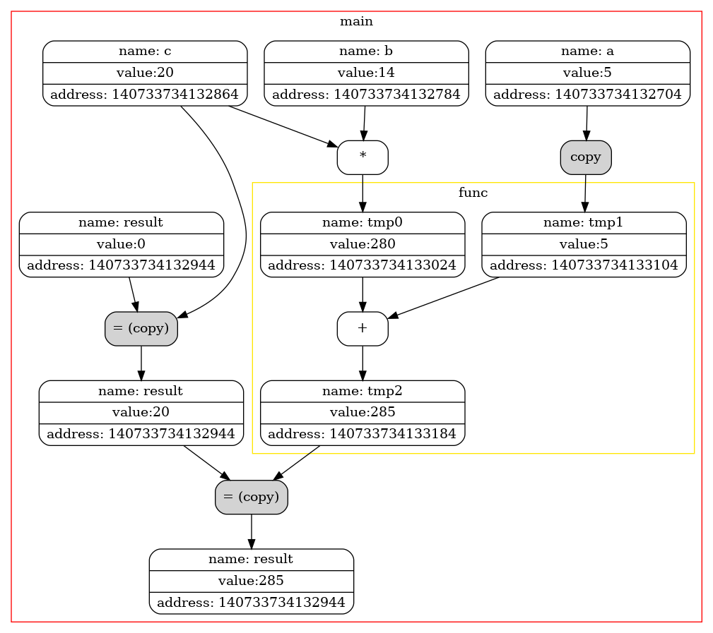

# Копирование и Перемещение
Задачей этой работы является детальное изучение разницы между семантикой копирования и перемещения с подробной визуализацией.
# Специальный флаг
Оптимизации компилятора позволяют не создавать временный объект, который используется только для инициализации объекта такого же типа. 
Флаг -fno-elide-constructors отключает эту оптимизацию и позволит более детально рассмотреть вызовы конструкторов копирования (перемещения) во всех случаях.

    
    

