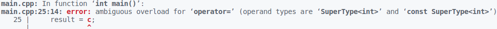

# Предисловие
&nbsp;&nbsp;&nbsp;&nbsp;С приходом эры c++11/14 мир кардинально изменился, обычный мир семантики копирования дополнился незримым миром волшебства- семантики перемещения. Задача этой работы заключается в изучении этого мира, прикрытого завесой тайны, и тех, кто в нем обитает. 

# Среда экспериментов 
 &nbsp;&nbsp;&nbsp;В качестве подопытного, на примере которого мы будем наблюдать проявления копирования и перемещения, выступает класс SuperType\<T\>, который по существу является оберткой над любым типом T. В качестве инструмента для отображения неуловимых глазом различий семантик копирования и перемещения выступает класс Tracker с его помощником доктором Graphviz и его блок схем. В ходе экспериментов подопытному предстоит в различных модификациях выполнение задач, указываемых при выполнении.

&nbsp;&nbsp;&nbsp;&nbsp;Для выбора модификаций написан Makefile с командами для компиляции, во время запуска программы указывается название эксперимента и файл, который будет создан для отчета.

&nbsp;&nbsp;&nbsp;&nbsp;Формат компиляции - make {название модификации}.

&nbsp;&nbsp;&nbsp;&nbsp;Формат запуска    - ./main {название эксперимента} {путь к файлу отчета}.
 
# Копирование и Перемещение. Первая часть.
&nbsp;&nbsp;&nbsp;&nbsp;Первая часть исследования заключается в осознании различий семантики копирования и перемещения, а так же мест их использования. Блок схемы этой части построены на основе незамысловатого кода

```
#include "SuperType.hpp"
#include "SuperType.hpp"

template<class T>
SuperType<T> func(SuperType<T> a, SuperType<T> b)
{
    a.rename("func_a");
    b.rename("func_b");
    start_function()
    SuperType<int> c = a + b;
    c.rename("c");
    end_function()
    return c;
}

void test_move_semantic()
{
    start_function();
    
    SuperType<int> a(5);
    a.rename("a");
    SuperType<int> b(14);
    b.rename("b");
    SuperType<int> c(20);
    c.rename("c");
    SuperType<int> result(0);
    result.rename("result");

    result = c;
    result = func(a, b * c);
    
    end_function();
}
```
    
# RVO/RNVO
&nbsp;&nbsp;&nbsp;&nbsp;Оптимизации компилятора позволяют не создавать временный объект, который используется только для инициализации объекта такого же типа. Эта оптимизация носит название RVO/RNVO. Проще говоря:
```
SL::SuperType<int> a = c + b; 
```
При отсутствии этой оптимизации, во время работы кода будет создан дополнительный временный объект, который расположен в области определения a, в него будет скопирован результат операции c + b, после этого он будет скопирован в объект а. Оптимизация приводит к отсутствию этого временного объекта. 

&nbsp;&nbsp;&nbsp;&nbsp;Флаг -fno-elide-constructors отключает эту оптимизацию и позволит более детально рассмотреть вызовы конструкторов копирования (перемещения) во всех случаях.

<p>
    
    
</p>

Команды для запуска эксперимента 

Без флага:
``` 
 make default
 ./main test_move_semantic ../diagrams/graph_no_flag.dot
```
С флагом:
```
 make default_flag
 ./main test_move_semantic ../diagrams/graph_flag.dot
```
 
# Конструктор и оператор копирования 
&nbsp;&nbsp;&nbsp;&nbsp;Если писать следуя стандартам с++98/03, то мы будем располагать лишь копирующими конструкторами, суть которых заключается в полном копировании классов с их атрибутами.

<p> 
    
</p>

Полное копирование является ресурсоемкой операцией, поэтому в блок схеме она выделена красным, как нежелательные блоки в программе, хотя в некоторых случаях их избежать нельзя.

 ```
 make default_flag
 ./main test_move_semantic ../diagrams/graph_copy.dot
```

# Конструктор и оператор перемещения
&nbsp;&nbsp;&nbsp;&nbsp;В c++11/14 появились понятия rvalue и lvalue ссылок, которые указывают на объекты с разной памятью.

&nbsp;&nbsp;&nbsp;&nbsp;У объектов типа lvalue есть идентифицируемое место в памяти, а у rvalue нет, он является временным. Семантика перемещения основана на объектах типа rvalue и дарует возможность оптимизировать код с помощью идеи взятия атрибутов у временного объекта, заменяя собой семантику копирования.

 &nbsp;&nbsp;&nbsp;&nbsp;Если описывать идею в деталях, то можно провести циничную аналогию с покойником и его драгоценностями. Труп представляет собой временный объект, а его драгоценности это его атрибуты. Будучи живым, объектом lvalue, можно задуматься, а зачем ему сокровища? В общем-то незачем, поэтому объект lvalue может забрать аттрибуты с rvalue, забрав его драгоценности. Чем это отличается от операции копирования? Тем, что если у объектов есть указатель на динамическую память, нам не придется ее копировать по байтам, нам нужно всего лишь взять указатель у rvalue, а у него его забрать, чтобы деструктор не "удалил" драгоценности.
 
&nbsp;&nbsp;&nbsp;&nbsp;Перемещающие конструкторы и операторы присваивания менее ресурсоемкие в сравнении с копирующими, поэтому в блок схеме они горят зеленым, как наиболее желательные для вызова. 

<p>    
    
</p>  

 Команды для эксперимента
 ```
 make move_semantic_flag
 ./main test_move_semantic ../diagrams/graph_move.dot
 ```
 
# Сравнение изменений
&nbsp;&nbsp;&nbsp;&nbsp;Несмотря на лучшую производительность компилятор не заменил всю копирующую семантику на перемещающую, так как она становится альтернативой, только когда речь заходит об объектах типа rvalue, выступающих в роли объектов для инициализации или присваивания. Если внимательно посмотреть на код, то становится ясно, что в некоторых случаях без копирования обойтись нельзя.

<p>
    
    
</p>

# Странные вариации семантики копирования и перемещения

## Странные методы копирования

&nbsp;&nbsp;&nbsp;&nbsp;Стандартным способом объявления копирующих конструктора и оператора присваивания является такой код:
~~~
SuperType<T>(const SuperType<T> &that, const std::string &name = "");    
SuperType<T> &operator= (const SuperType<T> &that);
~~~
&nbsp;&nbsp;&nbsp;&nbsp;Несмотря на это по ошибке можно задать эти два метода так.
~~~
SuperType<T>(SuperType<T> &that, const std::string &name = "");
SuperType<T> &operator= (SuperType<T> &that);
~~~
&nbsp;&nbsp;&nbsp;&nbsp;Единственное, что изменится с неправильным вариантом, это отсутствие возможности использования конструктора и оператора с константными объектами. Во время компиляции кода: 
```
const SuperType<int> object_1(20);
SuperType<int> object_2(object_1);
```
&nbsp;&nbsp;&nbsp;&nbsp;мы получим ошибку вида 


которая является вполне логичной, так как объект object_1 не является константным. 
Попробовав запустить 
```
const SuperType<int> object_1(20);
SuperType<int> object_2(0);
    
object_2 = object_1;
```
мы получим           


 Команды для эксперимента:
 ```
 make wrong_copy_semantic_flag
 ./main test_move_semantic ../diagrams/graph_wrong_copy.dot
 ```
 
## Странные методы перемещения

&nbsp;&nbsp;&nbsp;&nbsp;Аналогично с кодом для семантики перемещения.
Перемещающие методы обычно выглядят так 
```
SuperType<T>(SuperType<T> &&that, const std::string &name = "");
SuperType<T> &operator= (SuperType<T> &&that);
```
&nbsp;&nbsp;&nbsp;&nbsp;Несмотря на это по ошибке ее можно задать так
```
SuperType<T>(const SuperType<T> &&that, const std::string &name = "");
SuperType<T> &operator= (const SuperType<T> &&that);
```

&nbsp;&nbsp;&nbsp;&nbsp;Код скомпилируется, однако вся магия семантики перемещения улетучится и мы вернемся обратно во времена с++98/03, когда всем миром правила семантика копирования. Причиной станет константность, котороая не позволит выполнить обмен полями и перемещение превратится в копирование. Блок схема в таком случае преобразится.

 <p>
    
    
 </p>
 
Команды для эксперимента:
 ```
 make wrong_move_semantic_flag
 ./main test_move_semantic ../diagrams/graph_wrong_move.dot
 ```
 
# Резюмируем
&nbsp;&nbsp;&nbsp;&nbsp;На первый взгляд может показаться, что можно остаться в старом мире, в котором правит всем понятное копирование, а все нововведения с приходом семантики перемещения это over engineering, так как она применяется не на каждом шагу. Однако на продемонстрированном простом примере можно наблюдать, что она применяется гораздо чаще, чем это может казаться.

# Чудеса или универсальная ссылка. Часть вторая.
 С появлением понятий lvalue и rvalue ссылок, пришло понятие универсальной ссылки. Универсальная ссылка это шаблонная ссылка, которая может быть как rvalue, так и lvalue. 
 
 
 На практике она будет выглядеть так
 ```
template <typename T>
void func(T&& param, std::string param_name)
{
    using boost::typeindex::type_id_with_cvr;

    std::cout << "T: " << type_id_with_cvr<T>().pretty_name() << '\n';

    std::cout << "param: " << param_name << " is " << type_id_with_cvr<decltype(param)>().pretty_name() << "\n\n" ;
}

int main()
{
    SuperType<int> object_1(100500);

    func(object_1, "object_1");
    func(SuperType<int>(100500), "object_2");
}
 ```
 
 И не возникнет удивления, если в консоли мы увидим лог о двух rvalue ссылках. Но так не будет, консоль покажет нам:
 
 Её поведение объясняется на примере флюгера, чье положение зависит от направления ветра. Ссылка становится lvalue или rvalue в зависимости от того, какие параметры ей придут.
 
 Команды для эксперимента:
 ```
 make move_semantic_flag
 ./main test_universal_reference
 ```
 
 # Move vs Forward. Часть третья.
&nbsp;&nbsp;&nbsp;&nbsp;Вот мы и добрались до фантастических тварей, пришедших вместе с новым миром: move и forward. Главное, что о них стоит сейчас понять, что они ничего не делают.
 
 &nbsp;&nbsp;&nbsp;&nbsp;move - ничего не перемещает.
 
 &nbsp;&nbsp;&nbsp;&nbsp;forward - ничего не передает.
 
&nbsp;&nbsp;&nbsp;&nbsp;Зачем же они нужны, если они "ничего не делают"? Оказывается, это не совсем так. 
 
Move выполняет безусловное приведение своего аргумента к rvalue.
```
template <typename T>
decltype(auto) move(T &&param)
{
    using ReturnType = std::remove_reference_t<T>&&;
    return static_cast<ReturnType>(param);
}
```

Forward выполняет приведение при определенных условиях.
```
template <typename T>
T&& forward(std::remove_reference_t<T>& x) noexcept
{
    return static_cast<T &&>(x);
}
```

Разберем простейший пример функции swap.
```
template<class T>
void swap_default(T &&object1, T &&object2)
{    
    start_function();
    using T_ = std::remove_reference_t<T>;

    T_ temp(object1);
    temp.rename("temp");
    object1 = object2;
    object2 = temp;
    end_function();
}
```
&nbsp;&nbsp;&nbsp;&nbsp;Казалось бы, исследуя мир семантики перемещения и её законов, мы можем решить, что все будет основанно на перемещениях. Если только... Если только мы передаем в функцию аргументы в стиле rvalue, так как универсальная ссылка будет rvalue только при них. Хорошо, сделаем так, как просят того от нас законы мира волшебства, и да прибудет с нами сила перемещения...
 
```
template<class T>
void swap_default(T &&object1, T &&object2)
{    
    start_function();
    using T_ = std::remove_reference_t<T>;

    T_ temp(object1);
    temp.rename("temp");
    object1 = object2;
    object2 = temp;
    end_function();
}

void test_swap_default()
{
    start_function();

    SuperType<int> a(10);
    a.rename("a");
    SuperType<int> b(20);
    b.rename("b");
    
    swap_default(std::dynamic_cast<SuperType &&>(a), std::dynamic_cast<SuperType<int> &&>(b));

    end_function();
}
```
 


&nbsp;&nbsp;&nbsp;&nbsp;Однако никакого перемещения с нами не прибыло, только руки все в чем... хм, запах копирования. Но в чем проблема? Где наше перемещение, почему мы снова в мире маглов, а волшебного мира как-будто и не было?

&nbsp;&nbsp;&nbsp;&nbsp;Проблема заключается в том, что аргументы функции ссылки rvalue, но самими rvalue они не являются, у них же есть свои имена (отличительная особенность lvalue). Что тогда делать? Ранее были определены move и forward, и кажется, что наиболее очевидная функция move должна подойти, сняв личину с аргументов.

```
template<class T>
void swap_move(T &&object1, T &&object2)
{    
    start_function();
    using T_ = std::remove_reference_t<T>;

    T_ temp(move(object1));
    temp.rename("temp");
    object1 = move(object2);
    object2 = move(temp);
    end_function();
}
```


О чудо! Сила перемещения снова с нами, и все работает так, как мы и хотели. Move, кажется, сторонник грубой силы, ее инструмент, волшебная палочка, больше похожа на дубинку, и под её влиянием любой станет rvalue. Любой станет rvalue? И везде воцарится перемещение, наш граф будет гореть зеленым, а мы будем покруче Гарри Поттера, ибо волшебство будет всегда с нами, да ещё какое...

&nbsp;&nbsp;&nbsp;&nbsp;Ну что ж, сейчас мы сделаем "красиво", написав мини класс Beast с функцией set_lifestyle(), можно подумать, натравим move на все и вся, пусть везде будет волшебство и счастье.
```
class Beast
{
public:
    SuperType<std::string> lifestyle_;

    Beast() : lifestyle_("not exist") {
        lifestyle_.rename("lifestyle_");
    }

    template<class T>
    void set_lifestyle(T&& lifestyle)
    {
        lifestyle_ = move(lifestyle);
    }
};

```
&nbsp;&nbsp;&nbsp;&nbsp;Однако так ли это? Что будет, если мы напишем вот так?
```
void test_move_forward()
{
    start_function();

    Beast lion;
    lion.set_lifestyle(SuperType<std::string>("predator"));

    SuperType<std::string> victim("victim");
    
    Beast sheep;
    sheep.set_lifestyle(victim);
    Beast cow;
    cow.set_lifestyle(victim);

    end_function();
}
```
&nbsp;&nbsp;&nbsp;&nbsp;Вжух! 

&nbsp;&nbsp;&nbsp;&nbsp;И мы разбились о собственное мировоззрение, кажется, что move переборщивает с прибабахом. Ранее перемещение объяснялось на примере мертвых, и это не спроста. Приведение к rvalue это подстать убийству, rvalue это мертвый объект, которому в этом мире ничего уже не надо, это "мародерство". То, чем мы занимаемся, это "грабеж средь бела дня" без задней мысли о том, что будет с тем, у кого мы украли. Неужели придется запереть move до лучших времен очевидного swap, а самим сидеть в скучном мире копирования...

&nbsp;&nbsp;&nbsp;&nbsp;И тут из леса выходит новый зверь, forward.

&nbsp;&nbsp;&nbsp;&nbsp;Что такое функция forward? Ранее было сказано, что у нее какое-то условное приведение и бла-бла-бла. Видимо, у нее какая-то особая миссия, давайте проверим.
```
class Beast
{
public:
    SuperType<std::string> lifestyle_;

    Beast() : lifestyle_("not exist") {
        lifestyle_.rename("lifestyle_");
    }

    template<class T>
    void set_lifestyle(T&& lifestyle)
    {
        lifestyle_ = std::forward(lifestyle);
    }
};
```

&nbsp;&nbsp;&nbsp;&nbsp;О чудо! Сила перемещения переполняет нас, и всё работает так, как мы... Хотели? Да, мы этого хотели, но кто такой forward, и почему он нам помог? Оказывается, что forward приводит условное приведение, rvalue к rvalue, lvalue к lvalue. 

# Итоги сравнения 

&nbsp;&nbsp;&nbsp;&nbsp;Может показаться, что мы нашли универсальный способ решения всех наших проблем, быть может, это наш философский камень. С технической точки зрения ответ утвердительный: forward может сделать все, необходимости в move нет.

&nbsp;&nbsp;&nbsp;&nbsp;Привлекательными сторонами std::move являются удобства, снижение вероятности ошибок и большая ясность. Поэтому стоит использовать move там, где ясно приведена ссылка на rvalue, а в случае универсальной ссылки стоит ограничиться forward.
 
